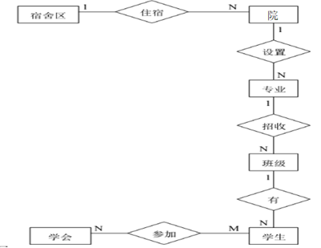

一、简答题(本大题共6小题, 每小题5分, 共30分) 分数 评卷人

1. 简述保护数据库安全性的措施。
   常用的数据库安全性措施有用户标识与鉴别、存取控制、视图、审计和数据加密等。

2. 什么是派生属性？在不同设计阶段，需要什么样的特别处理？
   派生属性的值可以从其他相关属性或实体计算得到，因此派生属性也称计算属性。在总体E-R图设计或者模式设计时，这种属性需要去掉，在进行外模式设计时，考虑到用户的多样化需求，这种属性一般会再添加上。

3. 简述关系的完整性规则。

关系的完整性规则包括实体完整性，参照完整性和用户自定义的完整性。

4. 简述数据库设计的阶段及标识性成果。

1) 需求分析阶段：数据字典和数据流图。
2) 概念设计阶段：全局E-R图。
3) 逻辑结构设计阶段：数据库逻辑模式，如关系模型，建立外模式（视图）。
4) 物理设计阶段：物理存储安排、设计索引，形成数据库内模式。
5) 数据库实施阶段：建立数据库模式、加载数据，并调试和试运行数据库应用程序。

5. 如何看待数据库中的冗余现象？

1) 一方面，正是因为数据中有冗余，产生了各种存储异常（修改异常、插入异常和删除异常）。问题的解决需要采用模式分解，为了保证实现自然连接，也需要保持一定的数据冗余。
2) 另一方面，数据库恢复技术需要底限思维，为了防止最坏情况发生，数据库中的数据需要通过冗余技术进行存储。
   总之，冗余，对于数据库而言，有积极因素，也有消极因素。

6. 简述何为并发调度，并说明并发执行的好处。
   并发调度是对一组事务而言，是指这组事务中至少有两个事务都开始了执行，并且都尚未结束。并发执行可以：1) 提高吞吐量和资源的利用率，2) 减少等待时间。

二、关系代数和SQL语句(本大题共2小题, 每小题20分, 共40分) 分数 评卷人7. 三个关系如下:
S(学号, 姓名, 出生年月, 性别, 籍贯)
C(课程号, 课程名, 学分, 课程性质)
SC(学号, 课程号, 成绩)
用关系代数表达下列查询:
(1) 查询河南籍同学的姓名、性别和年龄;
(2) 计算“必修”课程的总学分;
(3) 列举选修了C201号课程的学生学号;
(4) 检索选修“数据库原理”的学生姓名、课程名、学分和成绩，直接给出采用启发策略和代数优化后的表达式;
(5) 查询所有课程全优的学生的学号及姓名。

参考答案：
(1) ∏姓名, 性别, 2023-year(出生年月) as 年龄(籍贯＝“河南”(S) );
(2) sum(∏学分(课程性质＝“必修”(C) ) );
(3) ∏学号(课程号＝“C201”(SC) ) ;
(4) ∏姓名,课程名,学分,成绩(∏学号, 姓名(S) SC ∏课程号, 课程名, 学分课程名＝“数据库原理”(C));
(5) ∏学号, 姓名(C) ∏学号(成绩>90(SC)÷∏课程号(SC) );

8. 设数据库中有三个关系:
   EMP(Eno, Ename, Age, Sex, City) 其属性分别表示工号, 姓名, 年龄, 性别和籍贯。
   WORKS(Eno, Cno, Salary) 其属性分别表示职工号, 工作公司编号和工资。
   COMP(Cno, Cname, City) 其属性分别公司编号, 公司名和公司所在城市。
   试写出下列操作的SQL语句:
   (1) 用SQL语句创建这三个表;
   (2) 检索不超过45岁的职工的工号、姓名和年龄;
   (3) 查询在自己本地工作的职工工号、姓名、公司名和城市;
   (4) 查找在郑州工作的职工工号、姓名和性别;
   (5) 删除年龄大于60岁的职工相关信息，注意表之间的关联性。

参考答案：
(1) Create table EMP( Eno char (4) Primary key,  
Ename chare(8) not null,  
Age smallint,
Sex char(1),
City char(20));
Create table COMP(Cno char(4) primary key,
Cname char(20) not null,
City char(20));
Create table WORKS(Eno char(4) not null,
Cno char(4) not null,
Salary smallint,
Primary key(Eno,Cno),
Foreign key (Eno) references EMP(Eno),
Foreign key (Cno) references COMP(Cno));
(2) SELECT Eno, Ename, Age
FROM EMP
WHERE age<=50;
(3) SELECT Eno, Ename, Cname, COMP.City as City
FROM EMP, WORKS, COMP
WHERE EMP.Eno=WORKS.Eno AND COMP.Cno=WORKS.Cno AND
COMP.City=EMP.City;
(4) SELECT Eno, Ename, Sex
FROM EMP, WORKS, COMP
WHERE EMP.Eno=WORKS.Eno AND COMP.Cno=WORKS.Cno AND
COMP.City=”郑州”;
(5)DELETE FROM WORKS
Where Eno in(SELECT Eno FROM EMP WHERE Age>60);
DELETE FROM EMP WHERE Age>60;

三、分析设计及应用题(本大题共2小题, 每小题15分, 共30分) 分数 评卷人9. 准备根据某大学的院、学生、班级、学会等信息建立一个数据库。需求如下：一个院开设若干专业，每个专业每年招收多个班级，每个班有若干学生。一个院的学生住在同一宿舍区。每位学生可以参加多个学会，每个学会有若干学生，学生参加某学会有个入会年份。
根据上述信息, 完成如下问题: (1) 试设计相应的E-R模型; (2) 进一步转换成关系模型并优化。

参考答案：
(1) 相应的E-R模型：

(2) 优化后的关系模型：
宿舍区（宿舍区编号，宿舍区名）
院（院号，院名，联系电话，宿舍区标号）
专业（专业号，专业名，院号）
班级（班级编号，班级号，专业号）
学生（学号，姓名，出生年月，入学年份，班级编号）
学会（学会编号，学会名称，成立年份）
参加（学号，学会编号，入会时间）

10. 设关系模式STC（Sno, Tname, Cname），其中Sno, Tname, Cname分别表示学号，教师名和课程名。关系约束如下：
    (1) 某一学生选定某门课程就对应一个固定的教师；
    (2) 每一个教师只教一门课程，而每门课程有若干教师讲授。
    试回答：
    (1) 关系模式STC是否属于3NF？
    (2) 关系模式STC是否属于BCNF？若不是，请将其分解为BCNF。

参考答案：
(1) 函数依赖为{Sno,Cname→Tname, Tname→Cname}
关系的码为(Sno,Cname)和(Sno,Tname)
关系STC的所有属性都是主属性，无非主属性, 所以，STC属于3NF。
(2) 函数依赖Tname→Cname的决定部分不含码，所以不是BCNF。
分解为BCNF的结果{R1(Tname, Cname), R2(Sno,Tname)}。
