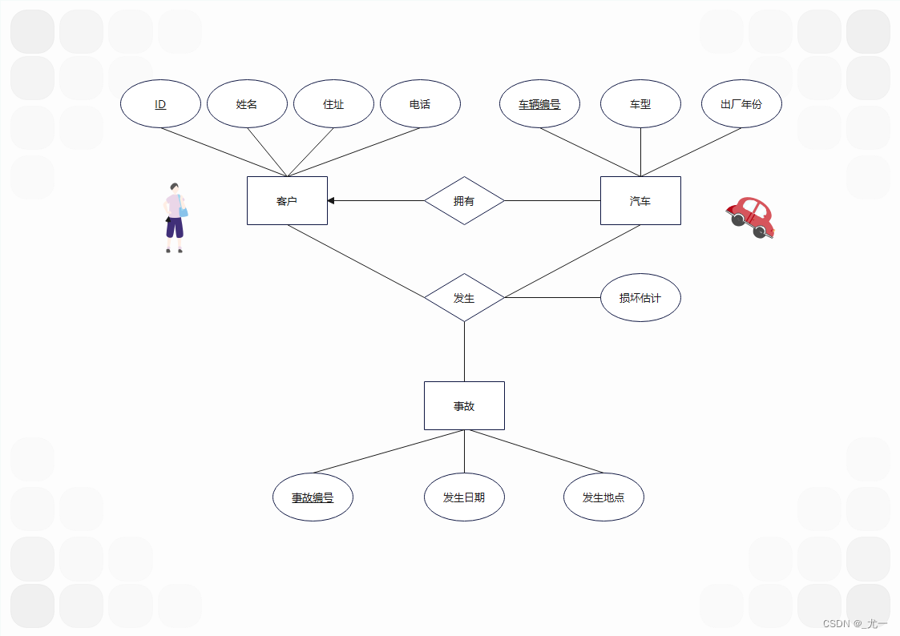
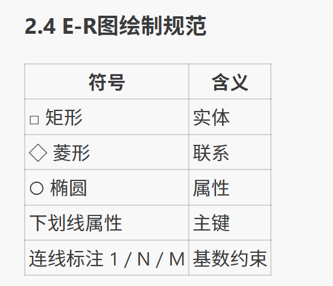
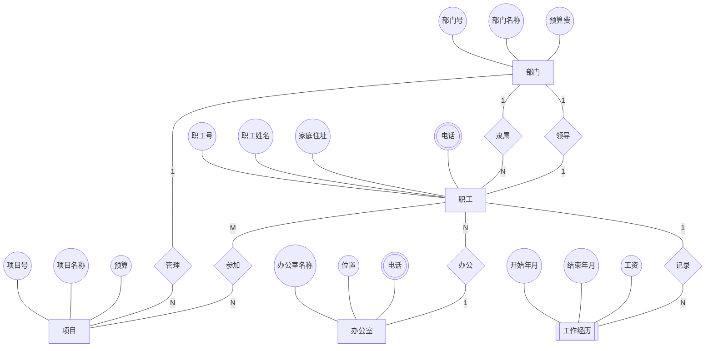

1. 2.7为汽车保险公司设计一个E-R图。每个客户拥有一辆或多辆汽车。每辆汽车可能发生0次或多次交通事故。客户需要登记的信息包括客户ID（如身份证号）、姓名、住址、电话等信息。车辆需要登记车辆编号、车型、出厂年份等信息。事故需要登记事故编号、事故发生日期、发生地点、损坏估计等信息。

找出涉及的所有实体，用矩形表示。
找到所有实体的属性，用椭圆表示，其中不同类型的属性需要考虑不同的表示。例如：
1. 主码(primary key)文字下面要有横线，一个实体最多只有一个主码。
2. 多值属性可以用双椭圆框
3. 派生属性用虚线椭圆框
4. 分析所有实体之间的联系，看哪两个实体之间存在联系，联系用菱形框表示
5. 分析联系的类型，一对一，多对一，一对多，一端用箭头，多端用无向边
分析实体在联系中的参与度

**联系也可以有属性**

2. 2.8工商银行有许多支行，每个具有唯一的名称，拥有一定的资产，坐落在某个城市的某条街道上。银行要记录每位客户的客户标识（如身份证号）、客户名、客户地址、联系电话等信息。银行的主要业务是办理客户的存款和贷款。每位客户可以有多个存款账户，并可以多次存取款；存款账户需要存放账号和存款余额等信息；每次存取款需要登记日期和存取款金额。一位客户可以多次贷款，但每笔贷款只能贷给一个客户。每笔贷款还与特定的支行相关联。每笔贷款需要登记贷款号、贷款日期和贷款金额。根据这些信息，为工商银行设计一个E-R图

3. 2.10某公司有若干个部门:每个部门有若干职工、项目和办公室。每个职工都有工作经历，记录该职工做过的每项工作的起止年月和工资。每个办公室有若干部电话。对于部门，需要记录部门号(唯一)、部门名称、预算费和部门领导的职工号。对于职工，除工作经历外，还需要记录职工号(唯一)、职工姓名、家庭住址、当前参加的项目、所在办公室、电话等信息。对于项目，需要记录项目号(唯一)、项目名称和预算。对于办公室，需要记录办公室名称(唯一)、位罚、电话。根据这些信息，为该公司的数据库设计E-R模型(用E-R图表示)。必要时，你可以做一些合理假设。

### E-R图（Mermaid）

**E-R图图例：**

| Mermaid语法 | 形状 | 含义 | 对应概念 |
|:-----------:|:----:|:----:|:--------:|
| `[部门]` | 矩形 □ | 实体 | 部门、职工、项目、办公室 |
| `[[工作经历]]` | 双矩形 ═ | **弱实体** | 工作经历（依赖职工存在） |
| `{隶属}` | 菱形 ◇ | 联系 | 隶属、领导、管理等6个联系 |
| `((部门号))` | 椭圆 ○ | 属性 | 实体的各项属性 |
| `(((电话)))` | 双椭圆 ◎ | **多值属性** | 职工电话、办公室电话 |
| `---` | 实线 | 属性/联系连线 | 无箭头连接 |
| `-- 1 ---` | 线上文字 | **基数标注** | 1、N、M 表示一对多/多对多 |

**各联系说明：**

| 联系名 | 实体A | 基数 | 实体B | 基数 | 语义 |
|:------:|:-----:|:----:|:-----:|:----:|:----:|
| 隶属 | 部门 | 1 | 职工 | N | 一个部门有若干职工 |
| 领导 | 部门 | 1 | 职工 | 1 | 一个部门有一名领导 |
| 管理 | 部门 | 1 | 项目 | N | 一个部门管理若干项目 |
| 参加 | 职工 | M | 项目 | N | 多对多（M:N） |
| 办公 | 职工 | N | 办公室 | 1 | 多个职工在一间办公室 |
| 记录 | 职工 | 1 | 工作经历 | N | 弱实体标识性联系 |

**合理假设：**
1. 每个职工必须属于一个部门
2. 一个职工最多领导一个部门
3. "位罚"为"位置"的笔误
4. 工作经历的"开始年月"作为部分键（与职工号共同标识弱实体）
5. 职工与办公室为多对一（一个职工一间固定办公室）
6. 电话作为多值属性，转关系模式时需单独建表

**主键说明（下划线标注）：**
- 部门：部门号
- 职工：职工号
- 项目：项目号
- 办公室：办公室名称
- 工作经历：（职工号，开始年月）联合部分键

