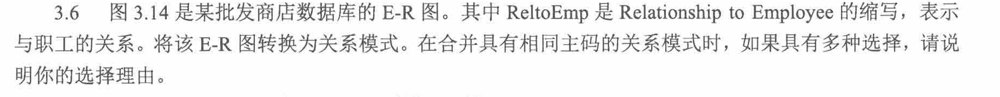
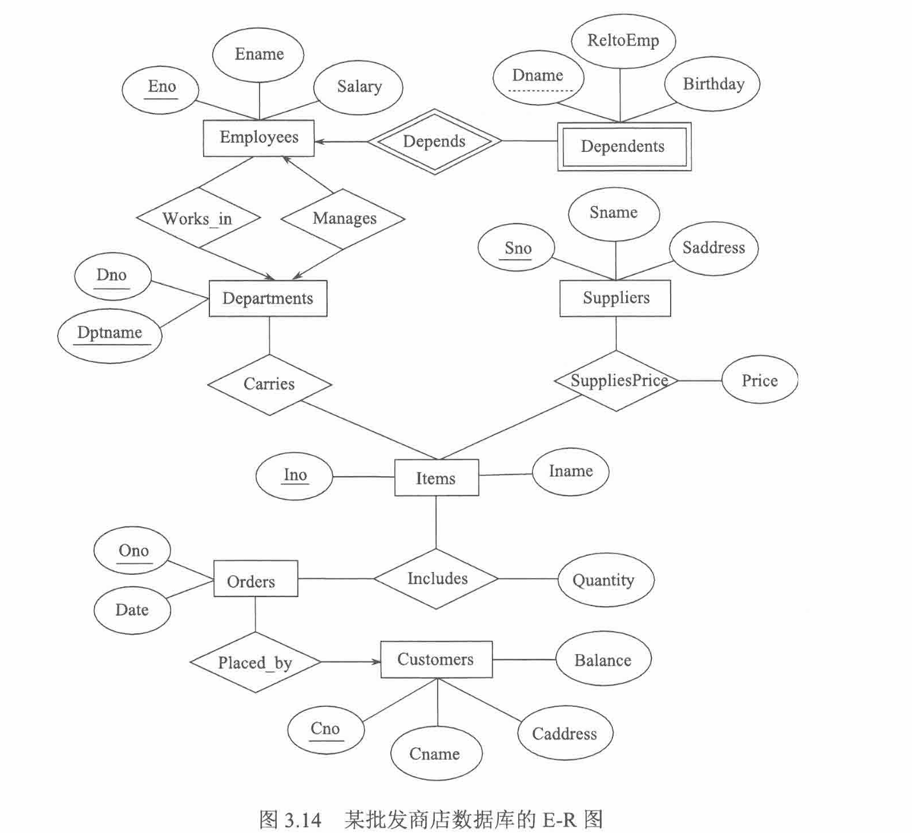
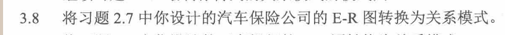

核心规则：

* 强实体集：一个关系模式
* 弱实体集：加上所属强实体的主码组成联合主码。自己不能靠自己的属性唯一标识自己，必须依赖另一个强实体集才能被唯一标识的实体集。双矩形，标识性联系用双菱形
* 1：N：1端放N端作为外码，可以喝N端合并
* M比N：单独建立联系表
* 带属性：联系属性放进联系关系
* 箭头指向：1端

employees(Eno,Ename,Salary)

主码Eno

外码：Dno引用Departments（Dno）。works_in建立在这里

Departments(Dno,Dptname,ManagerEno)

主码：Dno

Dptname候选码

ManagerENo外码：引用Employees(ENo)

Dependents(Eno, Dname, Birthday, ReltoEmp)
主码：(Eno, Dname)
外码：Eno 引用 Employees(Eno)

Carries(Dno, Ino)
主码：(Dno, Ino)
外码：Dno 引用 Departments(Dno)
外码：Ino 引用 Items(Ino)

SuppliesPrice(Sno, Ino, Price)
主码：(Sno, Ino)
外码：Sno 引用 Suppliers(Sno)
外码：Ino 引用 Items(Ino)

Includes(Ono, Ino, Quantity)
主码：(Ono, Ino)
外码：Ono 引用 Orders(Ono)
外码：Ino 引用 Items(Ino)

# 3.9 将习题2.8中你设计的工商银行的E-R图转换为关系模式。

客户（ID，姓名，住址，电话）

汽车（车辆编号，车型，出厂年份，ID）

事故（事故编号，发生日期，发生地点）

发生（ID，车辆编号，事故编号，损坏估计）

# 

3.11 设供应商-工程-零件数据库包含如下关系：

Suppliers (Sno, Sname, Status, Scity)

Parts (Pno, Pname, Color, Weight)

Projects (Jno, Jname, Jcity)

SPJ (Sno, Pno, Jno, Quantity)

其中，各关系的主码用下横线标示。Sno, Sname, Status, Scity分别表示供应商的编号、名称、状态和所在城市；Pno, Pname, Color, Weight分别表示零件的编号、名称、颜色和重量；Jno, Jname, Jcity分别表示工程的编号、名称和所在城市；SPJ是供应关系，Quantity是特定供应商一次向特定工程供应的特定零件的数量。用关系代数表示如下查询：

**自然连接 ⋈，选择 σ，投影 π，差集 -，除法 ÷。**

  关系代数查询
  ├── 选择 σ
  │   └── 按条件筛选行，例如 σScity='上海'(Suppliers)
  ├── 投影 π
  │   └── 取指定列，例如 πSno(SPJ)
  ├── 连接 ⋈
  │   └── 多表联合查询，通常按同名属性自然连接
  ├── 差 −
  │   └── 表示“没有、不属于、不满足”
  └── 除法 ÷
      └── 表示“全部、所有、至少包含某集合中的全部元素”

  1. 先看查询目标：要输出哪些属性。
  2. 再看限制条件：城市、颜色、数量、编号等。
  3. 如果涉及多个表，先连接。
  4. 如果是“没有 / 不提供 / 未使用”，用全集减去满足条件的集合。
  5. 如果是“所有 / 全部 / 至少包含全部”，考虑除法。

(1)求上海的所有供应商的信息。

σ Scity='上海' (Suppliers)

(2) 求位于郑州的所有工程的信息。

σ Jcity='郑州' (Projects)

(3) 求数量在100~150之间的供应。

σ Quantity>=100 ∧ Quantity<=150 (SPJ)

(4) 求为工程J1提供零件的供应商号。

π Sno (σ Jno='J1' (SPJ))

(5) 求供应工程J1红色零件的供应商号。

π Sno (σ Jno='J1' (SPJ) ⋈ σ Color='红色' (Parts))

(6) 求至少提供一种红色零件的供应商名称。

π Sname (Suppliers ⋈ SPJ ⋈ σ Color='红色' (Parts))

(7) 求不提供零件P2的供应商名称。

π Sname ((π Sno (Suppliers) - π Sno (σ Pno='P2' (SPJ))) ⋈ Suppliers)

(8) 求没有使用天津供应商生产的红色零件的工程号。

π Jno (Projects)
-
π Jno (σ Scity='天津' (Suppliers) ⋈ SPJ ⋈ σ Color='红色' (Parts))

(9) 求使用了本地供应商提供的零件的工程号和工程名称。

  “本地供应商”表示：

  Suppliers.Scity = Projects.Jcity

π Jno,Jname (σ Scity=Jcity (Suppliers ⋈ SPJ ⋈ Projects))

(10) 求未使用本地供应商提供的零件的工程号和工程名称。

  πJno,Jname(Projects)
  −
  πJno,Jname(σScity=Jcity(Suppliers ⋈ SPJ ⋈ Projects))

(11) 求至少用了供应商S1所供应的全部零件的工程号。

  这是典型除法题。

  供应商 S1 供应过的所有零件：

  πPno(σSno='S1'(SPJ))

  每个工程使用过的零件：

  πJno,Pno(SPJ)

  所以答案：

  πJno,Pno(SPJ) ÷ πPno(σSno='S1'(SPJ))

(12)求提供所有零件的供应商名称。

  先求“供应了所有零件的供应商号”：

  πSno,Pno(SPJ) ÷ πPno(Parts)

  再连接 Suppliers 取名称：

  πSname(
    Suppliers ⋈ (πSno,Pno(SPJ) ÷ πPno(Parts))
  )

  最重要的三题是 (7)、(11)、(12)：
  (7) 考差运算，(11)(12) 考除法。

#

5. (简答题)
3.14 对于供应商-工程-零件数据库，用扩展的关系代数运算表示如下查询：

(1) 求提供了零件的供应商的个数。

(2) 求所有零件的平均重量。

(3) 求供应商S1提供的每种零件的总数量。

(4) 求供应商S1供应工程J1的每种零件的总重量。

#

6. (简答题)
3.16 对于习题3.6得到的关系模式，完成如下更新操作：

(1) 将Cno、Cname、Caddress和Balance分别为C0199、李华、郑州市大学北路46号、6000的客户信息插入Customers。

(2) 从Dependents（家属）中删除1979年前出生的子女（ReltoEmp=‘子女’）。

将销售部门（Dname=‘销售’）的职工工资（Salary）提高4%。

