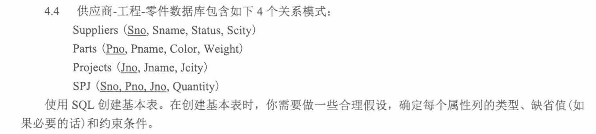
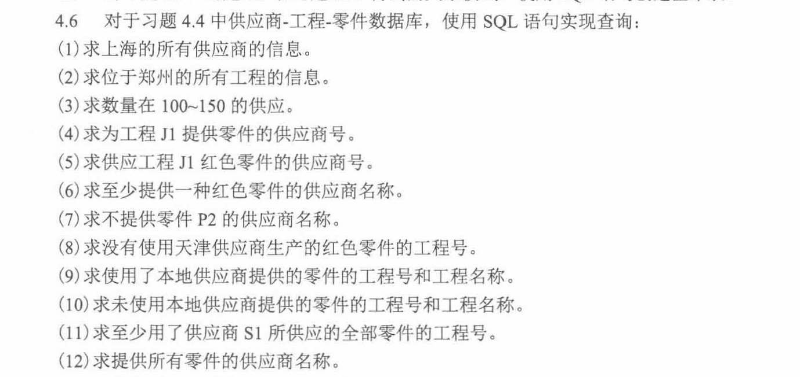
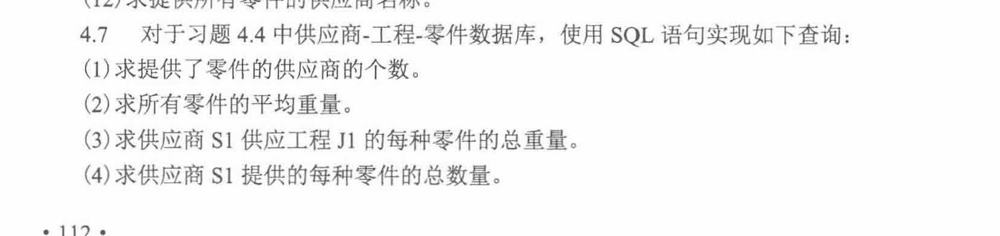
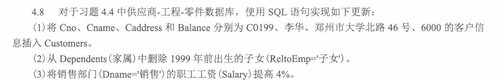
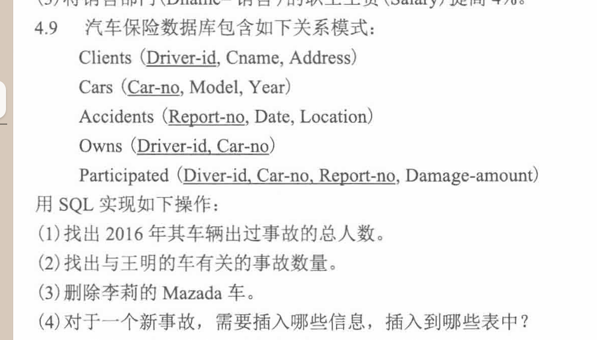

```
  建表 SQL
  ├── 属性类型
  │   ├── 编号：CHAR 或 VARCHAR(char固定，varchar变长，  name CHAR(10)
  name VARCHAR(10)

  如果存入 'abc'：

  CHAR(10)     实际按 10 个字符长度处理，后面可能补空格
  VARCHAR(10) 只存 abc 本身的长度
)
  │   ├── 名称、城市、颜色：VARCHAR
  │   ├── 状态、重量、数量：INT 或 DECIMAL
  │
  ├── 主键 PRIMARY KEY
  │   ├── 唯一标识一条记录
  │   ├── 自动 NOT NULL
  │   └── SPJ 表通常使用联合主键
  │
  ├── 外键 FOREIGN KEY
  │   ├── SPJ.Sno 引用 Suppliers.Sno
  │   ├── SPJ.Pno 引用 Parts.Pno
  │   └── SPJ.Jno 引用 Projects.Jno
  │
  ├── 缺省值 DEFAULT
  │   ├── Status 可以设默认值
  │   ├── Quantity 可以设默认值
  │   └── Color 也可以设默认值，如 '未知'
  │
  └── 检查约束 CHECK
      ├── Status >= 0
      ├── Weight > 0
      └── Quantity > 0

```

```sql
  CREATE TABLE 表名 (
      列名 数据类型 约束,
      ...
  );
```
主键：PRIMARY KEY

外键：  FOREIGN KEY (Sno) REFERENCES Suppliers(Sno)

约束：


  PRIMARY KEY      -- 主键
  FOREIGN KEY      -- 外键
  NOT NULL         -- 非空
  DEFAULT          -- 默认值
  CHECK            -- 检查条件


```sql
  CREATE TABLE Suppliers (
      Sno CHAR(5) PRIMARY KEY,
      Sname VARCHAR(20) NOT NULL,
      Status INT DEFAULT 0,
      Scity VARCHAR(20)
  );

  CREATE TABLE Parts (
      Pno CHAR(5) PRIMARY KEY,
      Pname VARCHAR(20) NOT NULL,
      Color VARCHAR(10),
      Weight DECIMAL(8, 2) CHECK (Weight > 0)
  );

  CREATE TABLE Projects (
      Jno CHAR(5) PRIMARY KEY,
      Jname VARCHAR(20) NOT NULL,
      Jcity VARCHAR(20)
  );

  CREATE TABLE SPJ (
      Sno CHAR(5),
      Pno CHAR(5),
      Jno CHAR(5),
      Quantity INT DEFAULT 0 CHECK (Quantity >= 0),

      PRIMARY KEY (Sno, Pno, Jno),

      FOREIGN KEY (Sno) REFERENCES Suppliers(Sno),
      FOREIGN KEY (Pno) REFERENCES Parts(Pno),
      FOREIGN KEY (Jno) REFERENCES Projects(Jno)
  );
```



## 投影、选择、连接

选择：where

投影：select xx

连接：

例如 SPJ 里只有零件号 PNO，不知道颜色；零件颜色在 P 表里。所以想查“红色零件”，必须连接 SPJ 和 P：

`SPJ JOIN P ON SPJ.PNO = P.PNO`

## DISTINGCT : 消除重复行

## 范围：BETWEEN...AND...

## 子查询：EXISTS和NOT EXISTS：

EXISTS：子查询是否能查到至少一行

```sql
WHERE EXISTS (
    SELECT 1
    FROM ...
    WHERE ...
)
```

如果子查询有结果就为真

## 所有全部问题：双重NOT EXISTS

求提供所有零件的供应商名称。

-》对每一个零件 P，都不存在“这个供应商没有提供 P”的情况。

-》不存在一个零件P，S没有提供P

```sql
WHERE NOT EXISTS (
    SELECT 1
    FROM P
    WHERE NOT EXISTS (
        SELECT 1
        FROM SPJ
        WHERE ...
    )
)
```



聚集函数：对多行数据同级

1. `SELECT COUNT(DISTINCT Sno) AS 供应商个数
FROM SPJ;`

2. `SELECT AVG(Weight) AS 平均重量
FROM Parts;`


3.   

```sql
SELECT SPJ.Pno,
       SUM(SPJ.Quantity * Parts.Weight) AS 总重量
FROM SPJ
JOIN Parts ON SPJ.Pno = Parts.Pno
WHERE SPJ.Sno = 'S1'
  AND SPJ.Jno = 'J1'
GROUP BY SPJ.Pno;
```

4.  

```sql
SELECT Pno,
       SUM(Quantity) AS 总数量
FROM SPJ
WHERE Sno = 'S1'
GROUP BY Pno;
```

总结

```sql
SELECT 分组列, 聚集函数
FROM 表
WHERE 筛选条件
GROUP BY 分组列;
```




数据更新：

```sql
INSERT INTO ... VALUES ...
DELETE FROM ... WHERE ...
UPDATE ... SET ... WHERE ...
```

1.  INSERT INTO 表名（列名） VALUES（）。字符串要加单引号

```sql
INSERT INTO Customers (Cno, Cname, Caddress, Balance)
VALUES ('C0199', '李华', '郑州市大学北路46号', 6000);
```

2. 删除：DLETE FROM 表名 WHERE 条件

```sql
DELETE FROM Dependents
WHERE ReltoEmp = '子女'
  AND Birthdate < '1999-01-01';
```

3. 修改：UPDATE 表明 SET 列 = 新值 WHERE 条件

```sql
UPDATE Employees
SET Salary = Salary * 1.04
WHERE Dno IN (
    SELECT Dno
    FROM Departments
    WHERE Dname = '销售'
);
```

IN表示是否属于一个集合



步骤：

1. 题目最终要什么
2. 条件在哪张表
3. 表之间靠什么联系(常见主码连外码)

### 

要的是人

人   clients/owns
拥有车  owns
事故  participated
2016？ accidents

Owns 找车主
↓
Participated 看这辆车是否参与事故
↓
Accidents 判断事故日期是不是 2016 年
↓
COUNT(DISTINCT Driver_id) 数不同的人

```sql
SELECT COUNT(DISTINCT O.Driver_id) AS total_people
FROM Owns AS O
JOIN Participated AS P
  ON O.Car_no = P.Car_no
JOIN Accidents AS A
  ON P.Report_no = A.Report_no
WHERE A.Date >= '2016-01-01'
  AND A.Date < '2017-01-01';
```