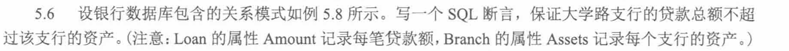
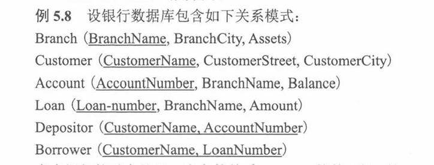
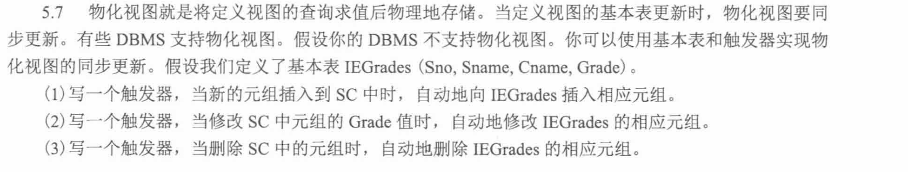

```sql
CREATE ASSERTION some_assertion
CHECK (...);
```

大学路支行的贷款总额 ≤ 大学路支行的资产

也就是

所有属于大学路支行的 Loan.Amount 加起来，不能超过 Branch.Assets

贷款总额：

```sql

SELECT SUM(Amount)
FROM Loan
WHERE BranchName = '大学路支行';

```

大学路资产

```sql
SELECT Assets
FROM Branch
WHERE BranchName = '大学路支行';
```

```sql
CREATE ASSERTION check_university_road_loan
CHECK (
    (
        SELECT COALESCE(SUM(Amount), 0)
        FROM Loan
        WHERE BranchName = '大学路支行'
    )
    <=
    (
        SELECT Assets
        FROM Branch
        WHERE BranchName = '大学路支行'
    )
);
```

约束一般用 NOT EXISTS 所以改成不存在`大学路支行的贷款总额 > 大学路支行的资产`

```sql
NOT EXISTS (
    SELECT *
    FROM Branch b
    WHERE b.BranchName = '大学路支行'
      AND 贷款总额 > b.Assets
)

```

`COALESCE(a, b, c, ...)`从左到右第一个非null，这里用来给初始值

```sql
CREATE ASSERTION check_university_road_loan
CHECK (
    NOT EXISTS (
        SELECT *
        FROM Branch b
        WHERE b.BranchName = '大学路支行'
          AND (
              SELECT COALESCE(SUM(l.Amount), 0)
              FROM Loan l
              WHERE l.BranchName = b.BranchName
          ) > b.Assets
    )
);
```



1. 普通视图：本质是个查询定义，不存真数据
2. 物化视图：把查询结果真的存成表
   1. 但是要和基础表同步更新

```
基础表变化
    ↓
触发器自动执行
    ↓
同步修改 IEGrades
```

3. 触发器：当某张表发生 INSERT / UPDATE / DELETE 时，自动做另一件事。

`INSERT INTO 表 VALUES (...)`
```sql
CREATE TRIGGER insert_IEGrades
AFTER INSERT ON SC
FOR EACH ROW
BEGIN
    INSERT INTO IEGrades(Sno, Sname, Cname, Grade)
    SELECT S.Sno, S.Sname, C.Cname, NEW.Grade
    FROM Student S, Course C
    WHERE S.Sno = NEW.Sno
      AND C.Cno = NEW.Cno;
END;
```

```sql
CREATE TRIGGER update_IEGrades
AFTER UPDATE OF Grade ON SC
FOR EACH ROW
BEGIN
    UPDATE IEGrades
    SET Grade = NEW.Grade
    WHERE Sno = NEW.Sno
      AND Cname = (
          SELECT Cname
          FROM Course
          WHERE Cno = NEW.Cno
      );
END;
```

```sql
CREATE TRIGGER delete_IEGrades
AFTER DELETE ON SC
FOR EACH ROW
BEGIN
    DELETE FROM IEGrades
    WHERE Sno = OLD.Sno
      AND Cname = (
          SELECT Cname
          FROM Course
          WHERE Cno = OLD.Cno
      );
END;
```