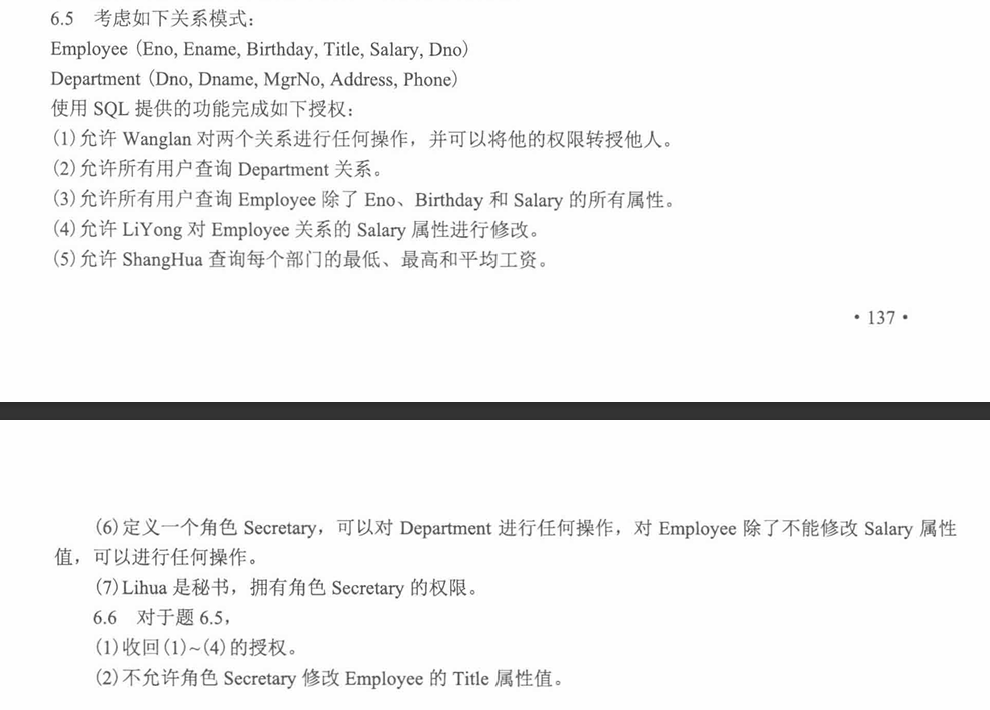

授权语法

```sql
GRANT 权限
ON 对象
TO 用户或角色
[WITH GRANT OPTION];
```

例如

`GRANT SELECT ON Department TO Wanglan;`

如果加上`WITH GRANT OPTION`

就是Wanglan 不仅自己能用这个权限，还能把这个权限再授权给别人。

2. 权限类型

```sql
SELECT    -- 查询
INSERT    -- 插入
UPDATE    -- 修改
DELETE    -- 删除
```

所有 `GRANT ALL PRIVILEGES ON 表名 TO 用户;`

`PUBLIC`所有

3. 列级操作

```sql
GRANT UPDATE(Salary)
ON Employee
TO LiYong;
```

4. 经常不是给原表权限，而是给一个被限制过的视图的权限
5. 角色Role：把一组权限打包

```sql
CREATE ROLE 角色名;
GRANT 权限 ON 对象 TO 角色名;
GRANT 角色名 TO 用户;
```

6. 收回：REVOKE

```sql
REVOKE 权限
ON 对象
FROM 用户或角色;
```

7. `WITH GRANT OPTION`和`CASCADE`

```sql
REVOKE ALL PRIVILEGES
ON Employee
FROM Wanglan
CASCADE;
```

不仅收回 Wanglan 的权限，也收回那些依赖 Wanglan 授权而来的权限。

如果写

```sql
RESTRICT
```

如果 Wanglan 已经把权限转授给别人，那就不允许直接收回。


答案

```sql
GRANT ALL PRIVILEGES ON Employee TO Wanglan WITH GRANT OPTION;
GRANT ALL PRIVILEGES ON Department TO Wanglan WITH GRANT OPTION;
```

```sql
GRANT SELECT ON Department TO PUBLIC;
```

```sql
CREATE VIEW Emp_public AS
SELECT Ename, Title, Dno
FROM Employee;

GRANT SELECT ON Emp_public TO PUBLIC;
```

```sql
GRANT UPDATE(Salary)
ON Employee
TO LiYong;
```

```sql
CREATE VIEW Dept_salary_stat AS
SELECT Dno,
       MIN(Salary) AS MinSalary,
       MAX(Salary) AS MaxSalary,
       AVG(Salary) AS AvgSalary
FROM Employee
GROUP BY Dno;

GRANT SELECT ON Dept_salary_stat TO ShangHua;
```

```sql
CREATE ROLE Secretary;

GRANT ALL PRIVILEGES
ON Department
TO Secretary;

GRANT SELECT, INSERT, DELETE
ON Employee
TO Secretary;

GRANT UPDATE(Eno, Ename, Birthday, Title, Dno)
ON Employee
TO Secretary;
```

```sql
GRANT Secretary TO Lihua;
```

```sql
REVOKE ALL PRIVILEGES
ON Employee
FROM Wanglan
CASCADE;

REVOKE ALL PRIVILEGES
ON Department
FROM Wanglan
CASCADE;
```

```sql
REVOKE SELECT
ON Department
FROM PUBLIC;
```

```sql
REVOKE SELECT
ON Emp_public
FROM PUBLIC;
```

```sql
REVOKE UPDATE(Salary)
ON Employee
FROM LiYong;
```

```sql
REVOKE UPDATE(Salary)
ON Employee
FROM LiYong;
```

```sql
REVOKE UPDATE(Title)
ON Employee
FROM Secretary;
```

```sql
REVOKE UPDATE
ON Employee
FROM Secretary;

GRANT UPDATE(Eno, Ename, Birthday, Dno)
ON Employee
TO Secretary;
```